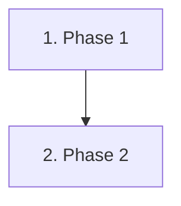

# [Workflow Name] Workflow

This document outlines the standard protocol for [purpose].

---

## 1. Prerequisites & Trigger Conditions

- **Trigger**: [When should this workflow be triggered?]
- **Rules Governance**: Enforces [Relevant rules, e.g., Code Quality Standard].

---

## 2. Execution Pipeline

### Phase 1: [Phase Name]
1. Step 1
2. Step 2

### Phase 2: [Phase Name]
1. Step 1
2. Step 2

---

## 3. Verification Checklist

- [ ] [Verification item 1]
- [ ] [Verification item 2]
