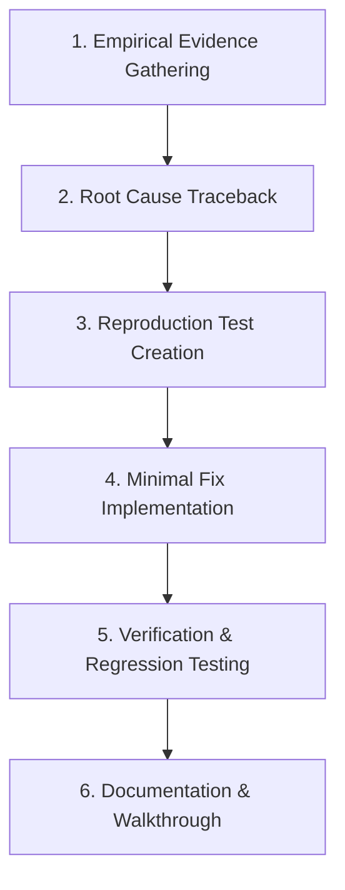

# Bug Fix & Debugging Workflow

This document outlines the mandatory protocol for investigating, diagnosing, fixing, and verifying bugs within the GeoSource workspace.

---

## 1. Prerequisites & Trigger Conditions

- **Trigger**: Any user issue report, test failure, runtime crash, uncaught exception, or unexpected UI behavior.
- **Rules Governance**: Enforces [Code Quality Standard](file:///c:/Storage/Development/Projects/Tauri/GeoSource/GeoSource.Template/.agents/rules/code-quality.md), [Testing & Verification Standard](file:///c:/Storage/Development/Projects/Tauri/GeoSource/GeoSource.Template/.agents/rules/testing-verification.md), and [Agentic Behavior Standard](file:///c:/Storage/Development/Projects/Tauri/GeoSource/GeoSource.Template/.agents/rules/agentic-behavior.md).

---

## 2. Execution Pipeline

### Phase 1: Empirical Evidence Gathering
> [!IMPORTANT]
> Never guess code logic or diagnose errors without reading un-truncated logs.

1. Fetch complete, un-truncated error logs, panic stack traces, or browser console output.
2. Locate the exact source line causing the failure.
3. Inspect surrounding code context using `view_file` (do not rely on partial snippets).

### Phase 2: Root Cause Traceback
1. Trace upstream data providers and caller sites to determine why invalid parameters or unexpected states occurred.
2. Check for known issues in relevant Knowledge Items (KIs) or recent commits.
3. Distinguish between symptom masking (e.g., adding `try/catch` or null fallbacks) vs. fixing the root contract failure.

### Phase 3: Reproduction Test Creation
1. Write a failing unit or integration test that reproduces the bug reproducibly.
2. Confirm the test fails with the expected error before applying any code changes.

### Phase 4: Minimal Fix Implementation
1. If the fix touches 2+ files or public APIs, construct an `implementation_plan.md` artifact and request user approval.
2. Apply the minimal targeted fix addressing the underlying root cause.
3. Preserve existing public contracts and docstrings.

### Phase 5: Verification & Regression Testing
1. Re-run the reproduction test and confirm it passes.
2. Run the entire test suite (`cargo test`, `pnpm test`) to guarantee zero regression across the codebase.
3. Run linting (`pnpm lint` or `cargo check`).

### Phase 6: Documentation & Walkthrough
1. Summarize the root cause, fix rationale, and test results in `walkthrough.md`.
2. If the bug surfaces a systemic design flaw, document an ADR or update workspace Knowledge Items.

---

## 3. Verification Checklist

- [ ] Un-truncated logs extracted and analyzed before code edits.
- [ ] Root cause identified (not symptom-masked with dummy fallbacks).
- [ ] Reproduction test added and verified failing prior to fix.
- [ ] Fix implemented with zero breaking API contract changes.
- [ ] All unit and integration tests passing clean.
- [ ] `walkthrough.md` generated with before/after trace evidence.
