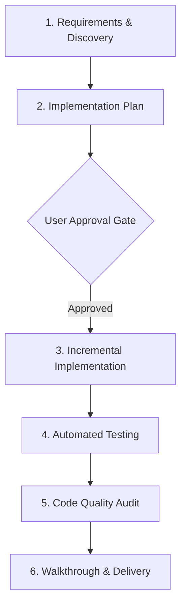

# Feature Development Workflow

This document outlines the standard protocol for proposing, architecting, building, and verifying new features in the GeoSource workspace.

---

## 1. Prerequisites & Trigger Conditions

- **Trigger**: Adding a new UI screen, new business logic module, backend Rust service, or extending existing functionality across 2+ files.
- **Rules Governance**: Enforces [Planning Architecture Standard](file:///c:/Storage/Development/Projects/Tauri/GeoSource/GeoSource.Template/.agents/rules/planning-architecture.md), [Code Quality Standard](file:///c:/Storage/Development/Projects/Tauri/GeoSource/GeoSource.Template/.agents/rules/code-quality.md), and [Tauri Rust Stack Standard](file:///c:/Storage/Development/Projects/Tauri/GeoSource/GeoSource.Template/.agents/rules/tauri-rust-stack.md).

---

## 2. Execution Pipeline

### Phase 1: Requirements & Discovery
1. Check existing Knowledge Items (KIs) and rules before performing code searches.
2. Perform targeted `grep_search` to identify existing utilities, components, and data structures.
3. If 2 or more unresolved design decisions exist, trigger `/grill-me` to interview the user.

### Phase 2: Implementation Plan & Approval Gate
1. Create `implementation_plan.md` in the active artifact directory.
2. Outline proposed file additions (`[NEW]`), modifications (`[MODIFY]`), verification plan, and trade-offs.
3. Set `RequestFeedback: true` and wait for explicit user approval before writing any implementation code.

### Phase 3: Incremental Implementation
1. Create `task.md` to track execution steps.
2. Implement backend Rust structures/commands first (if applicable), enforcing `thiserror`/`anyhow` error handling and avoiding `panic!`.
3. Update Tauri IPC permissions/whitelist configuration (`capabilities/`).
4. Implement TypeScript interfaces and typed `invoke` wrappers.
5. Create React/TypeScript UI components with proper styling, ARIA attributes, and dynamic layout constraints.

### Phase 4: Verification & Testing
1. Write unit tests for all new Rust modules and TypeScript utilities.
2. Write integration tests for new IPC command handlers.
3. Run Playwright visual tests (`npm run test:visual`) for any new UI components or layouts to capture and verify baseline visual snapshots.
4. Run project build and test commands (`cargo test`, `npm test`, `npm run build` or `cargo check`).

### Phase 5: Code Quality & Security Audit
1. Verify no unsafe blocks exist without mandatory `// SAFETY:` comments.
2. Ensure no hardcoded secret keys, static offsets, or non-null assertions (`!`) are introduced.
3. Check token and resource usage.

### Phase 6: Walkthrough & Delivery
1. Update `task.md` ensuring all checkboxes are marked complete.
2. Create `walkthrough.md` documenting modified files, test outputs, visual snapshot updates, and manual verification instructions.

---

## 3. Verification Checklist

- [ ] `implementation_plan.md` created and approved by user.
- [ ] Backend Rust logic contains no raw unhandled panics (`unwrap()`, `expect()`).
- [ ] Tauri IPC commands registered and whitelisted in capabilities.
- [ ] Typed TypeScript wrapper created in frontend API layer.
- [ ] Visual snapshot tests (`npm run test:visual`) executed and baseline screenshots verified.
- [ ] Unit & integration tests pass cleanly.
- [ ] `walkthrough.md` created with verification logs.