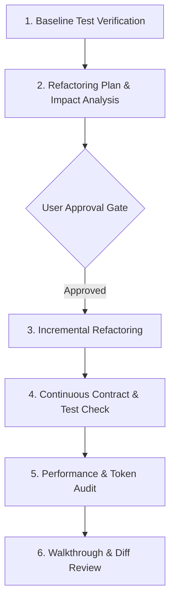

# Refactoring & Code Quality Workflow

This document outlines the standard protocol for refactoring code, eliminating technical debt, and improving software architecture without introducing breaking changes or regressions.

---

## 1. Prerequisites & Trigger Conditions

- **Trigger**: Cleaning up technical debt, modularizing monolithic files, optimizing performance, updating obsolete APIs, or improving code structure across the project.
- **Rules Governance**: Enforces [Code Quality Standard](file:///c:/Storage/Development/Projects/Tauri/GeoSource/GeoSource.Template/.agents/rules/code-quality.md), [Token Efficiency Standard](file:///c:/Storage/Development/Projects/Tauri/GeoSource/GeoSource.Template/.agents/rules/token-efficiency.md), and [Testing & Verification Standard](file:///c:/Storage/Development/Projects/Tauri/GeoSource/GeoSource.Template/.agents/rules/testing-verification.md).

---

## 2. Execution Pipeline

### Phase 1: Baseline Test Verification
1. Run existing test suite (`cargo test`, `pnpm test`) before making any code changes.
2. Confirm 100% clean passing baseline. Do NOT begin refactoring on top of a failing codebase.

### Phase 2: Refactoring Plan & Impact Analysis
1. Use `grep_search` to map all call sites, imports, and usages of symbols being refactored.
2. Create an `implementation_plan.md` artifact detailing the target changes, files modified, and contract preservation strategy.
3. Request explicit user approval before proceeding.

### Phase 3: Incremental Refactoring
1. Apply changes in small, logical steps. Refactor internal logic first before altering file structures or export names.
2. Update invocation sites immediately when changing internal signatures.
3. Preserve all existing docstrings, comments, and non-deprecated API contracts unless explicitly instructed.

### Phase 4: Continuous Verification
1. Run `cargo check` / `pnpm lint` after each atomic refactoring step.
2. Ensure test coverage does not drop.

### Phase 5: Performance & Token Audit
1. Verify refactored code reduces unnecessary allocations, redundant state updates, or oversized bundle imports.
2. Ensure file sizes remain modular (under ~400 lines per file where practical).

### Phase 6: Walkthrough & Diff Review
1. Review git diff (`git diff`) pre-flight to verify no unintentional file edits or trailing whitespace were introduced.
2. Summarize refactoring benefits, impact, and verification results in `walkthrough.md`.

---

## 3. Verification Checklist

- [ ] Baseline tests confirmed 100% passing prior to refactoring.
- [ ] Implementation plan approved by user.
- [ ] Refactoring performed incrementally with zero broken public contracts.
- [ ] All call sites updated.
- [ ] Full test suite passing with no coverage regression.
- [ ] Git diff inspected and verified clean.
