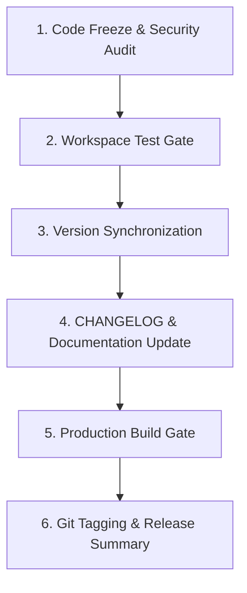

# Release Preparation Workflow

This document outlines the standard protocol for preparing, auditing, bumping version numbers, and building release candidates in the GeoSource workspace.

---

## 1. Prerequisites & Trigger Conditions

- **Trigger**: Preparing a release tag, production binary build, or version bump (major, minor, patch).
- **Rules Governance**: Enforces [Dependency Management Standard](file:///c:/Storage/Development/Projects/Tauri/GeoSource/GeoSource.Template/.agents/rules/dependency-management.md), [Git & Commit Discipline Standard](file:///c:/Storage/Development/Projects/Tauri/GeoSource/GeoSource.Template/.agents/rules/git-commit-discipline.md), and [Documentation Maintenance Standard](file:///c:/Storage/Development/Projects/Tauri/GeoSource/GeoSource.Template/.agents/rules/documentation-readme.md).

---

## 2. Execution Pipeline

### Phase 1: Code Freeze & Security Audit
1. Audit dependencies for security vulnerabilities (`cargo audit` / `pnpm audit`).
2. Verify all dependency versions are explicitly locked and `Cargo.lock` / `pnpm-lock.yaml` are clean.
3. Verify no debug flags, hardcoded tokens, or experimental console logs exist in production code paths.

### Phase 2: Workspace Test Gate
1. Execute full Rust unit and integration test suite (`cargo test --all`).
2. Execute full frontend unit/component test suite (`pnpm test`).
3. Verify zero lint errors (`pnpm lint`, `cargo clippy`).

### Phase 3: Version Synchronization
Synchronize version strings across all manifest files:
- `package.json`
- `src-tauri/Cargo.toml`
- `src-tauri/tauri.conf.json`

### Phase 4: CHANGELOG & Documentation Update
1. Update `CHANGELOG.md` following [Keep a Changelog](https://keepachangelog.com/) standards.
2. Group release notes into `Added`, `Changed`, `Deprecated`, `Removed`, `Fixed`, and `Security`.
3. Update `README.md` if public CLI flags, setup procedures, or requirements changed.

### Phase 5: Production Build Gate
1. Execute production build command (`pnpm tauri build` or `cargo build --release`).
2. Confirm release binaries generate without compilation errors or link failures.

### Phase 6: Release Summary & Git Commit
1. Create a release commit formatted as `chore(release): bump version to vX.Y.Z`.
2. Propose release tag `vX.Y.Z`.
3. Provide summary in `walkthrough.md`.

---

## 3. Verification Checklist

- [ ] Security audit completed with zero critical vulnerabilities.
- [ ] Cargo and PNPM locks up to date.
- [ ] Version numbers synchronized across `package.json`, `Cargo.toml`, and `tauri.conf.json`.
- [ ] `CHANGELOG.md` updated with release notes.
- [ ] Production build succeeds cleanly (`cargo build --release` / `pnpm tauri build`).
- [ ] All automated tests pass 100%.
