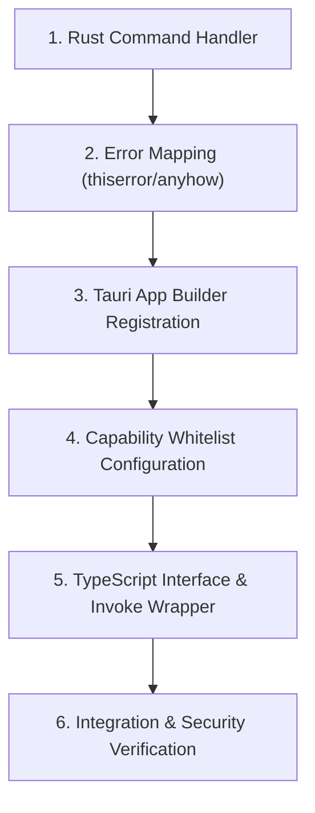

# Tauri IPC Integration Workflow

This document outlines the standard procedure for building, exposing, securing, and consuming Tauri Inter-Process Communication (IPC) commands across Rust backend and TypeScript frontend layers.

---

## 1. Prerequisites & Trigger Conditions

- **Trigger**: Exposing a Rust backend function to the frontend, modifying existing Tauri IPC command signatures, or updating Tauri permissions/capabilities.
- **Rules Governance**: Enforces [Tauri & Rust Stack Standard](file:///c:/Storage/Development/Projects/Tauri/GeoSource/GeoSource.Template/.agents/rules/tauri-rust-stack.md) and [Testing & Verification Standard](file:///c:/Storage/Development/Projects/Tauri/GeoSource/GeoSource.Template/.agents/rules/testing-verification.md).

---

## 2. Execution Pipeline

### Phase 1: Rust Backend Command Definition
1. Define the Rust command function in the appropriate module under `src-tauri/src/`.
2. Annotate with `#[tauri::command]`.
3. Use strict parameter types that derive `serde::Deserialize`.
4. Ensure no unhandled panics (`unwrap()`, `expect()`, `panic!`) can be triggered by frontend input.

### Phase 2: Error Mapping & Return Types
1. Map command error return types using `thiserror` or custom serializable error enums.
2. Ensure error messages returned to the frontend do not leak sensitive internal server paths or environment secrets.

### Phase 3: Registration & Capability Enforcement
1. Register the command in `tauri::generate_handler![...]` inside `src-tauri/src/lib.rs` (or `main.rs`).
2. Update capability ACL configuration (e.g. `src-tauri/capabilities/default.json`) to grant permission to invoke the command.

### Phase 4: TypeScript Frontend Wrapper
1. Define matching TypeScript interfaces for command request inputs and payload responses.
2. Create a strongly typed frontend `invoke` wrapper function in the API/services module (e.g. `src/lib/api/` or `src/ipc/`).
3. Handle potential `invoke` rejections gracefully with typed `try/catch` or Result wrapper.

### Phase 5: Verification & Safety Audit
1. Run `cargo check` and `cargo test` to verify Rust handler compilation and unit tests.
2. Run `pnpm check` / `pnpm build` to verify TypeScript type definitions match.
3. Perform integration test verifying IPC roundtrip.

---

## 3. Verification Checklist

- [ ] Command annotated with `#[tauri::command]`.
- [ ] Error handling uses serializable error types without panics.
- [ ] Registered in `tauri::generate_handler![]`.
- [ ] Capability permissions updated in `capabilities/`.
- [ ] Typed TypeScript wrapper created with explicit request/response interfaces.
- [ ] Rust cargo check and TypeScript build both complete cleanly.
